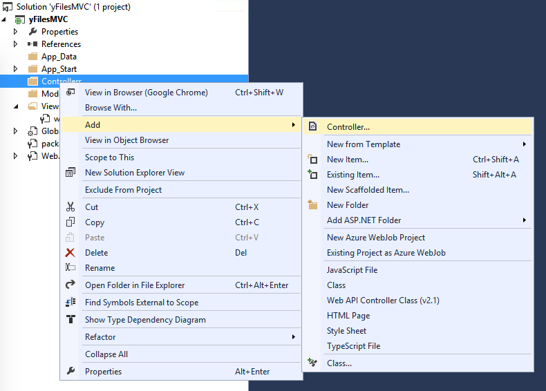

# yFiles for HTML with ASP.Net MVC backend

## Intro

## Setting up the web API

Start by creating an ASP.Net Web Application

Select the "Empty" project type but do include the "Web API" and "MVC" core references. You can also include unit tests and Azure publishing info if you wish but this is outside the scope of this overview.

The project does not contain anything visible because we selected the empty project. If you would have selected e.g. the "MVC Project" earlier you would have seen plenty of stuff related to login, Bootstrap and more.

Go ahead and add a controller to the "Controller" folder

this opens up a selection and you should choose the "Web API 2 Controller - Empty"

The other types articulate other functionality we don't wish to go into here. Call the new controller "APIController". This controller will contain the methods which will serve data via a REST-ful interface.

In a real-world application you would have some data access layer (DAL) or use some ORM (Entity Framework e.g.) to access your backend, but we will serve random data instead. To make the random data more than just arbitrary letters and numbers we'll make use of the Faker.Net package. It creates random yet meaningful bits like addresses, company names and much more.

Go to the "Manage NuGet Packages" in the solution

and install "Faker.Net" by searching for it in the "Online" drawer

Add the following bits of code to the APIController

    public class Person
    {
       public string FirstName { get; set; }
       public string LastName { get; set; }
    }

    public class APIController : ApiController
    {
       [HttpGet]
       [Route("API/GetRoot")]
       public Person GetRoot()
       {
           return new Person
                      {
                          FirstName = Faker.Name.First(),
                          LastName = Faker.Name.Last()
                      };
       }
    }

The `Route` attribute allows you to specify explicitly the way the web method is being accessed. By default the name of the method defines the REST address but the Route attribute gives more flexibility. You are free to use the default behavior however, all depends on the way you want to design the web API interface and how your overall architecture is designed. In any case, if you wish to use (like we do here) the Route attribute make sure the configuration is commented out like so

    public static class WebApiConfig
       {
           public static void Register(HttpConfiguration config)
           {
               // Web API configuration and services

               // Web API routes
               config.MapHttpAttributeRoutes();

               //config.EnableCors();
               //config.Routes.MapHttpRoute(
               //    name: "DefaultApi",
               //    routeTemplate: "api/{controller}/{id}",
               //    defaults: new { id = RouteParameter.Optional }
               //);
           }
       }

Things like CORS are important if you wish to use the webAPI outside the boundary of the ASP.Net website. More about all this can be found in [the documentation](https://msdn.microsoft.com/en-us/magazine/dn532203.aspx).

If you press run/debug and browse to the "/API/GetRoot" address you will see that the web method returns the serialized `Person` object in XML format. The ASP.Net runtime transparently does this in function of what is being requested, XML being the default.

In function of yFiles for HTML we would rather have the data returned in JSON format since XML needs to be explicitly parsed in JavaScript while JSON is the more natural data dialect. This happens automatically as well and can easily be tested out as follows.

Add a new HTML file to the root of the solution, call it "index.html". Add the following bits to it

    <!DOCTYPE html>
    <html xmlns="http://www.w3.org/1999/xhtml">
    <head>
        <title>yFiles for HTML with ASP.Net MVC</title>
        
        
    </head>
    <body>
        <h3>Fetching WebAPI data</h3>
        <input type="button" name="getter" id="getter" value="Get some data"/>
        

        
    </body>
    </html>

We use jQuery since it eases the client side development but if you venture into a large scale development you should carefully investigate options like Angular, Create, Backbone and the many other frameworks out there. While jQuery is fine for small things it does not enforces a solid client-side architecture and quickly turns your code in an unmaintainable heap. Bigger frameworks will help you to develop unit-tests, create responsive clients and much more.

In any case, if you now run the solution and browse to the HTML page you will see that on clicking the button the data is returned as JSON and can be directly used. The way ASP.Net does this is via the auto-included JSON.Net library (see the VS references). There are many ways this auto-serialization can be customized, see the JSON.Net documentation and the System.ComponentMode.DataAnnotations for more on this topic.

## Setting up yFiles

The yFiles for HTML documentation gives ample information how to set up your solution but let's summarize it again here for your convenience and to ensure that it works in the current ASP.Net context.

- create a folder in VS called "lib" and drop therein the yFiles directory containing all the yFiles for HTML scripts

- ensure that the trial or purchased license (yWorks.yFilesHTML.DevelopmentLicense.js) also sits in this folder. Without this file you won't be able to use the framework.

- alter the previously index.html file like so

      <!DOCTYPE html>
      <html xmlns="http://www.w3.org/1999/xhtml">
      <head>
          <title>yFiles for HTML with ASP.Net MVC</title>
          
          
          
          
          <link type="text/css" rel="stylesheet" href="lib/yFiles/yfiles.css">
          
      </head>
      <body>
          

              <h2>yFiles for HTML with ASP.Net MVC</h2>
              

                  

                      

                  

              

          

          
      </body>
      </html>

This give you a basic presentation where the `designDiv` will hold the yFiles canvas and the `app.js` will contain the necessary JavaScript code defining the logic of your application.

In the lib\app.js file add the following basic code which we will elaborate later on. For now it just adds a single shape to the canvas.

      var Module = yfiles.module;
      var Class = yfiles.lang.Class;
      require.baseUrl = "/lib/yFiles/"; // moving this to the config does not yield the same result
      require.config({
          "map": {
              "*": {
                  "yfiles/lang": "lib/yFiles/lang.js"
              }
          }
      });
      function isDefined(obj) {
          return obj !== undefined && obj !== null;
      }

      function isUndefined(obj) {
          return !isDefined(obj);
      }

      function isNullOrEmpty(s) {
          return isUndefined(s) || s.toString().trim().length === 0;
      }

      function LoadModule() {
          Module("OrgChart", function (exports) {

              var App = Class("App", {

                  constructor: function (options) {

                      // create the control for the specified div
                      this.graphControl = new yfiles.canvas.GraphControl.ForId(options.designName);

                      var node = this.graphControl.graph.createNode();

                      window.app = this;
                  }
              });

              exports.App = App;

          });
      }

      function requireStart() {
          LoadModule();
          var app = new OrgChart.App({
              designName: "designDiv"
          });
          app.Load();

      }

      require([
          "lib/yFiles/yWorks.yFilesHTML.DevelopmentLicense.js",
          "lib/yFiles/complete.js"
      ], requireStart);

The result of all this should be something like the following;

which obviously is nothing impressive but gives you a clean start for using yFiles and ASP.Net MVC.

## Fetching data and graph creation

Let's combine the WebAPI data access and present the data in the diagram.

First add an extra div panel to the index.html so that upon clicking a diagram node we'll fetch additional data and present it in this panel;

    

         <h2>yFiles for HTML with ASP.Net MVC</h2>
         

             

                 

             

         

         

             
Details

             
First name: 

             
Last name: 

         

     

## References

- [CORS support in ASP.Net WebAPI 2](https://msdn.microsoft.com/en-us/magazine/dn532203.aspx)
