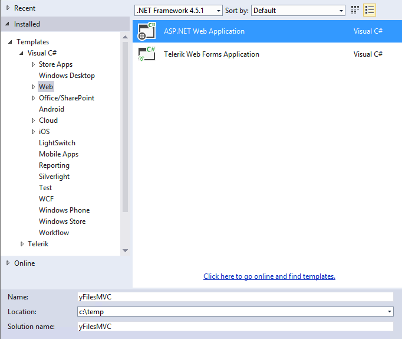

# yFiles for HTML 1.x with ASP.Net MVC backend

---
**NOTE**

This article was written for yFiles for HTML 1.x, which is deprecated, now. The 2.x series provides a greatly improved API.
Conceptually, however, most of the code can be reused. Specifically the ASP.net specific parts can be reused exactly. 
The JavaScript parts need some adjustments, though. They should be rather obvious if you have used the current yFiles API, before, though.
Still, if you need help, please contact our support team and tell them about the difficulties you were running into.

---

## Intro

This tutorial helps you create a simple application consisting of
- an HTML page with a yFiles for HTML diagram representing an organization chart with data fetched from an ASP.Net MVC backend
- an ASP.Net MVC website with a WebAPI representing a REST-ful interface to some data backend. We don't describe or include any concrete database (access) layer but rather use some pseudo-random data generation to mimic this layer. A discussion of an ORM or webservice underneath the WebAPI is outside the scope of this tutorial.

The application shows an organization chart which upon clicking a node gives more information about the selected person.

The architecture is a simple client-service communication with the browser having an active role in fetching the data via ajax, i.e. the application is a single-page application (SPA). We do not delve however in the many ways one can build up an MVC structure on the client using one of the many JS frameworks out there (Angular in particular). The application is meant to be a jump-start showing how to use ASP.Net MVC together with yFiles.

- [Setting up the web API](#SetupAPI)
- [Setting up yFiles](#Setupy)
- [Fetching data and graph creation](#FetchingData)
  - [Some more HTML and WebAPI](#MoreAPI)  
  - [The JavaScript application](#JSApp)
  - [Displaying a hierarchy](#Hierarchy)
- [A note about architecture and security](#Security)
- [References](#References)

## Setting up the web API

Start by creating an ASP.Net Web Application

Select the "Empty" project type but do include the "Web API" and "MVC" core references. You can also include unit tests and Azure publishing info if you wish but this is outside the scope of this overview.

The project does not contain anything visible because we selected the empty project. If you would have selected e.g. the "MVC Project" earlier you would have seen plenty of stuff related to login, Bootstrap and more.

Go ahead and add a controller to the "Controller" folder

this opens up a selection and you should choose the "Web API 2 Controller - Empty"

The other types articulate other functionality we don't wish to go into here. Call the new controller "APIController". This controller will contain the methods which will serve data via a REST-ful interface.

In a real-world application you would have some data access layer (DAL) or use some ORM (Entity Framework e.g.) to access your backend, but we will serve random data instead. To make the random data more than just arbitrary letters and numbers we'll make use of the Faker.Net package. It creates random yet meaningful bits like addresses, company names and much more.

Go to the "Manage NuGet Packages" in the solution

and install "[Faker.Net](https://www.nuget.org/packages/Faker.Net)" by searching for it in the "Online" drawer

Add the following bits of code to the APIController

    public class Person
    {
       public string FirstName { get; set; }
       public string LastName { get; set; }
    }

    public class APIController : ApiController
    {
       [HttpGet]
       [Route("API/GetRoot")]
       public Person GetRoot()
       {
           return new Person
                      {
                          FirstName = Faker.Name.First(),
                          LastName = Faker.Name.Last()
                      };
       }
    }

The `Route` attribute allows you to specify explicitly the way the web method is being accessed. By default the name of the method defines the REST address but the Route attribute gives more flexibility. You are free to use the default behavior however, all depends on the way you want to design the web API interface and how your overall architecture is designed. In any case, if you wish to use (like we do here) the Route attribute make sure the configuration is commented out like so

    public static class WebApiConfig
       {
           public static void Register(HttpConfiguration config)
           {
               // Web API configuration and services

               // Web API routes
               config.MapHttpAttributeRoutes();

               //config.EnableCors();
               //config.Routes.MapHttpRoute(
               //    name: "DefaultApi",
               //    routeTemplate: "api/{controller}/{id}",
               //    defaults: new { id = RouteParameter.Optional }
               //);
           }
       }

Things like CORS are important if you wish to use the webAPI outside the boundary of the ASP.Net website. More about all this can be found in [the documentation](https://msdn.microsoft.com/en-us/magazine/dn532203.aspx).

If you press run/debug and browse to the "/API/GetRoot" address you will see that the web method returns the serialized `Person` object in XML format. The ASP.Net runtime transparently does this in function of what is being requested, XML being the default.

In function of yFiles for HTML we would rather have the data returned in JSON format since XML needs to be explicitly parsed in JavaScript while JSON is the more natural data dialect. This happens automatically as well and can easily be tested out as follows.

Add a new HTML file to the root of the solution, call it "index.html". Add the following bits to it

    <!DOCTYPE html>
    <html xmlns="http://www.w3.org/1999/xhtml">
    <head>
        <title>yFiles for HTML with ASP.Net MVC</title>
        
        
    </head>
    <body>
        <h3>Fetching WebAPI data</h3>
        <input type="button" name="getter" id="getter" value="Get some data"/>
        

        
    </body>
    </html>

We use [jQuery](https://jquery.com) since it eases the client side development but if you venture into a large scale development you should carefully investigate options like Angular, Create, Backbone and the many other frameworks out there. While jQuery is fine for small things it does not enforces a solid client-side architecture and quickly turns your code in an unmaintainable heap. Bigger frameworks will help you to develop unit-tests, create responsive clients and much more.

In any case, if you now run the solution and browse to the HTML page you will see that on clicking the button the data is returned as JSON and can be directly used. The way ASP.Net does this is via the auto-included JSON.Net library (see the VS references). There are many ways this auto-serialization can be customized, see the JSON.Net documentation and the System.ComponentMode.DataAnnotations for more on this topic.

## Setting up yFiles

The yFiles for HTML documentation gives ample information how to set up your solution but let's summarize it again here for your convenience and to ensure that it works in the current ASP.Net context.

- create a folder in VS called "lib" and drop therein the yFiles directory containing all the yFiles for HTML scripts

- ensure that the trial or purchased license (yWorks.yFilesHTML.DevelopmentLicense.js) also sits in this folder. Without this file you won't be able to use the framework.

- alter the header of the previously created index.html file like so

      <title>yFiles for HTML with ASP.Net MVC</title>
      
      
      
      
      <link type="text/css" rel="stylesheet" href="lib/yFiles/yfiles.css">
      

as well as the body so that a DIV tag can hold the yFiles diagramming control;

    

         <h2>yFiles for HTML with ASP.Net MVC</h2>
         

             

                 

             

         

     

     

This give you a basic presentation where the `designDiv` will hold the yFiles canvas and the `app.js` will contain the necessary JavaScript code defining the logic of your application.

In the lib\app.js file add the following basic code which we will elaborate later on. For now it just adds a single shape to the canvas.

      var Module = yfiles.module;
      var Class = yfiles.lang.Class;
      require.baseUrl = "/lib/yFiles/"; // moving this to the config does not yield the same result
      require.config({
          "map": {
              "*": {
                  "yfiles/lang": "lib/yFiles/lang.js"
              }
          }
      });
      function isDefined(obj) {
          return obj !== undefined && obj !== null;
      }

      function isUndefined(obj) {
          return !isDefined(obj);
      }

      function isNullOrEmpty(s) {
          return isUndefined(s) || s.toString().trim().length === 0;
      }

      function LoadModule() {
          Module("OrgChart", function (exports) {

              var App = Class("App", {

                  constructor: function (options) {

                      // create the control for the specified div
                      this.graphControl = new yfiles.canvas.GraphControl.ForId(options.designName);

                      var node = this.graphControl.graph.createNode();

                      window.app = this;
                  }
              });

              exports.App = App;

          });
      }

      function requireStart() {
          LoadModule();
          var app = new OrgChart.App({
              designName: "designDiv"
          });
          app.Load();

      }

      require([
          "lib/yFiles/yWorks.yFilesHTML.DevelopmentLicense.js",
          "lib/yFiles/complete.js"
      ], requireStart);

The result of all this should be something like the following;

which obviously is nothing impressive but gives you a clean start for using yFiles and ASP.Net MVC.
Regarding the "require" in the script above, see the [asynchronous file and module loading](http://docs.yworks.com/yfileshtmlv2/index.html#/dguide/first_simple_app#asyncloading) topic in the yFiles documentation.

## Fetching data and graph creation

Let's combine the WebAPI data access and present the data in the diagram. We will create the following;

- a standard organization chart with data fetched from the WebAPI (delivered by the ASP.Net MVC backend)
- a side-panel presenting detailed information of a selected node (data taken again from the backend)

While the resulting app still remains fairly basic it does give you a fully functional yFiles frontend with ASP.Net backend which can serve as a jump-start for a more complex application with the same architecture.

### Some more HTML and WebAPI

First add a few extra div panels to the index.html so that upon clicking a diagram node we'll fetch additional data and present it in this panel;

    

         <h2>yFiles for HTML with ASP.Net MVC</h2>
         

             

                 

             

             

                 
Details

                 
First name: 

                 
Last name: 

             

         

     

     

     

Second, augment the `Person` object we created earlier with an identifier and add a `PersonAddress` class which will hold the extra data we capture when clicking on a diagram node;

      public class Person
    	{
    		public int Id { get; set; }
    		public string FirstName { get; set; }
    		public string LastName { get; set; }
    	}

    	public class PersonAddress
    	{
    		public string AddressLine { get; set; }
    		public string Zip { get; set; }
    		public string City { get; set; }
    		public string Country { get; set; }
    	}

On the level of the WebAPI we add a few more methods

    [HttpGet]
    [Route("API/GetRoot")]
    public Person GetRoot()
    {
    	return Cache.GetPerson(0);
    }

    [HttpGet]
    [Route("API/GetPerson/{id}")]
    public Person GetPerson(int id)
    {
    	return Cache.GetPerson(id);
    }

    [HttpGet]
    [Route("API/GetPersonAddress/{id}")]
    public PersonAddress GetPersonAddress(int id)
    {
    	return Cache.GetPersonAddress(id);
    }

The `Cache` object used above is just a simple way to make sure that whenever we access a `Person` the same data is returned (within the same server session at least). For example, the `Cache.GetPerson` method amounts to

      static Dictionary<int, Tuple<Person, PersonAddress>> cache =
          new Dictionary<int, Tuple<Person, PersonAddress>>();

      public static Person GetPerson(int id)
      {
      	if(!cache.ContainsKey(id)) {
      		var person = new Person {
      			Id = id,
      			FirstName = Faker.Name.First(),
      			LastName = Faker.Name.Last()
      		};
      		var personAddress = new PersonAddress {
      			AddressLine = Faker.Address.StreetAddress(),
      			City = Faker.Address.City(),
      			Zip = Faker.Address.ZipCode(),
      			Country = Faker.Address.Country()
      		};
      		cache.Add(id, Tuple.Create(person, personAddress));

      	}
      	return cache[id].Item1;
      }

In a real-world situation you would replace the `Cache` with an internal data access or a service-oriented (SOA) mechanism.

### The JavaScript application

On the level of JavaScript we need to add more structure to keep things ordered and [the yFiles class framework](http://docs.yworks.com/yfileshtmlv2/index.html#/dguide/class_framework) helps tremendously here.

Let's add a `NodeModel` which will hold the model or data bound to a diagram node;

        var NodeModel = Class("NodeModel",
            {
                constructor: {
                    default: function() {
                        this._id = "Item " + new Date().toISOString();
                        this._label = "New Item";
                    },
                    fromOptions: function(options) {
                        if(isDefined(options.Id)) this.Id = options.Id;
                        else this.Id = "Item " + new Date().toISOString();
                        if(isDefined(options.Label)) this.Label = options.Label;
                        else this.Label = "New Item";
                    }
                },
                get Id() {
                    return this._id;
                },
                set Id(value) {
                    this._id = value;
                },
                get Label() {
                    return this._label;
                },
                set Label(value) {
                    this._label = value;
                },
                $static: {
                    GetData: function(node) {
                        if(isUndefined(node)) return null;
                        var /**NodeModel*/ data = node.tag;
                        return isUndefined(data) ? null : data;
                    },
                    GetId: function(node) {
                        if(isUndefined(node)) return null;
                        var /**NodeModel*/ data = node.tag;
                        return isUndefined(data) ? null : data.Id;
                    },
                    GetLabel: function(node) {
                        if(isUndefined(node)) return null;
                        var /**NodeModel*/ data = node.tag;
                        return isUndefined(data) ? null : data.Label;
                    }
                }
            }
        );

You could mirror the `Person` class from ASP.Net (adding separate methods for FirstName, LastName etc.) but we wish to keep things simple here.

In a similar way, we'll add a simple `LinkModel` holding the relational information

        var LinkModel = Class("LinkModel",
            {
                constructor: {
                    default: function() {
                        this._from = "";
                        this._to = "";
                    },
                    fromOptions: function(options) {
                        if(isDefined(options.From)) this.From = options.From;
                        if(isDefined(options.To)) this.To = options.To;
                    }
                },
                get From() {
                    return this._from;
                },
                set From(value) {
                    this._from = value;
                },
                get To() {
                    return this._to;
                },
                set To(value) {
                    this._to = value;
                }
            });

At this point we should note that we won't make use of the [yFiles `GraphSource`](http://docs.yworks.com/yfileshtmlv2/index.html#/api/yfiles.binding.GraphSource) which offers
a data-binding highway between data and nodes (an MVVM paradigm, if you prefer). The choice really depends on the overall type of application you wish to develop and the architecture. Our approach here is somewhat more conservative and allows us to highlight a few standard yFiles techniques which are somewhat 'hidden' in the `GraphSource` class.

In order to make the `NodeModel` and `LinkModel` accessible you need to export them from the `OrgChart` namespace

    exports.NodeModel = NodeModel;
    exports.LinkModel = LinkModel;

The behavior of the yFiles graph control can be fine-tuned [`GraphEditorInputMode`](http://docs.yworks.com/yfileshtmlv2/index.html#/api/yfiles.input.GraphEditorInputMode) and we'll disable, among other things, the creation of new nodes upon clicking the canvas;

        GetDesignMode: function() {
              var designInputMode = new yfiles.input.GraphEditorInputMode();
              designInputMode.addItemLeftClickedListener(this.EditNodeClicked.bind(this));

              designInputMode.moveInputMode.Enabled = false;
              designInputMode.createBendInputMode.Enabled = false;
              designInputMode.showHandleItems = yfiles.graph.GraphItemTypes.EDGE;
              designInputMode.deletableItems = yfiles.graph.GraphItemTypes.NONE;
              designInputMode.createEdgeInputMode.Enabled = false;
              designInputMode.nodeCreationAllowed = false;
              designInputMode.marqueeSelectableItems = yfiles.graph.GraphItemTypes.NONE;
              designInputMode.deletableItems = yfiles.graph.GraphItemTypes.NODE;
              designInputMode.clickSelectableItems = yfiles.graph.GraphItemTypes.NODE;
              return designInputMode;
          }

This behavior should be set immediately after creating the graph control in the `App` constructor. We'll also add snapping and some node defaults;

      constructor: function(options) {
           // create the control for the specified div
           this.graphControl = new yfiles.canvas.GraphControl.ForId(options.designName);

           // enable some interaction
           this.graphControl.inputMode = this.GetDesignMode();

           // enable snapping
           var snapContext = new yfiles.input.GraphSnapContext();
           this.graphControl.inputMode.snapContext = snapContext;

           this.Graph.nodeDefaults.size = new yfiles.geometry.SizeD(180, 60);
           this.Graph.nodeDefaults.style = new yfiles.drawing.TemplateNodeStyle.WithKey("designTemplate");

           window.app = this;
       }

The design template above is a bit special in the sense that it sits between HTML and JavaScript. You need to define the visual template inside the HTML like so

    

See the [styling and templates](http://docs.yworks.com/yfileshtmlv2/index.html#/dguide/styles#styles_general) topic in the documentation for the many ways in which you can customize the appearance of nodes and links.

The all-crucial `AddNode` method is really a wrap around the yFiles `createNode` method with additionally binding the `NodeModel` to the `tag`

    AddNode: function(item) {
          var node = this.Graph.createNode();
          node.tag = item;
          return node;
      },

The `tag` binds the model to the diagram node and we use some utility methods to go from the node object to the model

      GetItem: function(node) {
               if(isUndefined(node)) return null;
               return node.tag;
           }

In the code you will find a similar method for the link.
To connect two nodes we wrap the `createEdge` method

          Connect: function(link, to) {
              if(isDefined(to)) {
                  return this.Connect(new yFlow.LinkModel.fromOptions({
                      From: link,
                      To: to
                  }));
              }
              else {

                  var source = this.GetNodeById(link.From);
                  var target = this.GetNodeById(link.To);
                  if(isDefined(source) && isDefined(target)) {
                      var edge = this.Graph.createEdge(source, target);
                      edge.tag = link;
                      return edge;
                  }
                  return null;
              }

          }
which allows us to refer to the Id of the underlying model rather than to a yFiles node instance.

Finally, after the graph is altered or created we want to layout the graph and, here again, yFiles offers a wealth of possibilities and customizations. We'll use the hierarchical layout we delivers a tree-like result but also works if the graph is not a true tree (i.e. there are cycles in the graph);

      Layout: function() {
               if(isUndefined(this.layouter)) {
                   this.layouter = new yfiles.hierarchic.IncrementalHierarchicLayouter();
                   this.layouter.orthogonalRouting = true;
               }
               this.graphControl.morphLayout(this.layouter, yfiles.system.TimeSpan.fromMilliseconds(1500), this.FitIt.bind(this));

           }
      FitIt: function() {
                   this.graphControl.fitGraphBoundsWithInsets(new yfiles.geometry.InsetsD(50));
               }

At this point all is in place to create and effectively do what we initially set out to do. So, let fetch the `GetRoot` from the WebAPI as we did earlier and add a diagram node for it

        Load: function() {
                var that = this;

                $.ajax({
                    url: "API/GetRoot/",
                    type: "GET"
                }).then(function(data) {

                    that.Graph.clear();
                    that.AddNode(new OrgChart.NodeModel.fromOptions({
                        Id: "Root",
                        Label: data.FirstName + " " + data.LastName
                    }));
                    that.Layout();
                });

            }

The reason that we define `that` is because of the closure and the fact that the `then` promise runs asynchronously in its own context. Using `this` inside the then-function would not access the `App` class.

If you run the application and browse to the index.html page you should see something similar to this (the name is randomly generated and likely different on restarting the server process);

### Displaying a hierarchy

Obviously we want more than just a single node and need to fetch a hierarchy from the WebAPI and there are various ways one can implement this. The easiest way is probably as follows, define server-side objects;

      public class PersonHierarchy
      	{

      		public List<Person> Nodes { get; set; }

      		public List<Link> Links { get; set; }

      		public PersonHierarchy()
      		{
      			this.Nodes = new List<Person>();
      			this.Links = new List<Link>();
      		}
      	}

      	public class Link
      	{
      		public int From { get; set; }

      		public int To { get; set; }
      	}

which captures the set of nodes and the set of links separately. Another way would be to use and adjacency list or alike.
Since we don't have a real relational structure in the backend we'll have to construct a random tree. Here as well, there are plenty of tricks and we'll use the following

      [HttpGet]
  		[Route("API/GetHierarchy/{id}/{count?}/{degree?}")]
  		public PersonHierarchy GetHierarchy(int id, int count = 20, int degree = 3)
  		{
  			// let's keep it tidy shall we?
  			degree = Math.Max(1, Math.Min(5, degree));
  			var hierarchy = new PersonHierarchy();
  			// make sure the root is already in the collection
  			hierarchy.Nodes.Add(Cache.GetPerson(0));
  			var parentId = 0;
  			// keep track of the node degrees
  			var degrees = new Dictionary<int,int>{ { 0,0 } };

  			for(int i = 1; i < count; i++) {
  				parentId = Rand.Next(hierarchy.Nodes.Count);
  				while(degrees[parentId] >= degree)
  					parentId = Rand.Next(hierarchy.Nodes.Count);

  				hierarchy.Links.Add(new Link{ From = parentId, To = i });
  				// include the new node
  				hierarchy.Nodes.Add(Cache.GetPerson(i));
  				// upstate the stats
  				degrees.Add(i, 0);
  				degrees[parentId] = degrees[parentId] + 1;
  			}
  			return hierarchy;
  		}

This basically adds random nodes to previously created nodes and ensuring that the degree of the parent-node and the total node-count are not surpassed.
Note that the web method has a few optional parameters and you can play with it for different results.

On the JavaScript side we need little chances to display this hierarchy. We simply loop over the returned nodes and links;

          Load: function() {
                var that = this;

                $.ajax({
                    url: "API/GetHierarchy/0",
                    type: "GET"
                }).then(function(data) {

                    that.Graph.clear();
                    if(data===undefined || data === null) return;
                    var nodes = data.Nodes;
                    var links = data.Links;

                    for(var k=0;k<nodes.length; k++){
	                    var node = nodes[k];
	                    that.AddNode(new OrgChart.NodeModel.fromOptions({
	                        Id: node.Id,
	                        Label: node.FirstName + " " + node.LastName
	                    }));
                    }
                    for(var k=0;k<links.length; k++){
	                    var link = links[k];
	                    that.Connect(new OrgChart.LinkModel.fromOptions({
	                        From: link.From,
	                        To: link.To
	                    }));
                    }
                    that.Layout();
                });

            }

The resulting diagram is something like the picture below.

Now, for the final bit related to clicking the nodes and showing the details in the side-panel.

Upon click the node we'll use once more a (combined) async ajax call

          EditNodeClicked: function(sender, e) {
                var node = e.item;
                var that = this;
                if(node == null) this.EnableEditor(false);
                else {
                    var id = this.GetItem(node).Id;
                    var fetchPerson = function(id) {
                        return $.ajax({
                            url: "API/GetPerson/" + id,
                            type: "GET"
                        });
                    }
                    var fetchAddress = function(id) {
                        return $.ajax({
                            url: "API/GetPersonAddress/" + id,
                            type: "GET"
                        });
                    }

                    $.when(fetchPerson(id), fetchAddress(id)).then(function(a, b) {

                        if(a[1] !== "success" || b[1] !== "success") {
                            alert("Could not fetch the details of this node.");
                            return;
                        }
                        var data = {
                            person: a[0],
                            address: b[0]
                        };

                        that.EditorData(data);
                        that.currentEdit = data;
                        that.EnableEditor(true);
                    });

                }
            }

the only yFiles note here if the conversion of the node object to the underlying `NodeModel` via the `GetItem` method. From the point on that you have a reference to the id you can fetch the data and handle things in a standard jQuery fashion

                EditorData: function(data) {
                if(isUndefined(data)) {
                   $("#FirstName").html("");
                   $("#LastName").html("");
                   $("#Address").html("");
                   $("#City").html("");
                   $("#Zip").html("");
                   $("#Country").html("");
                   this.EnableEditor(false);
                }
                else {
                    this.EnableEditor(true);
                    $("#FirstName").html(data.person.FirstName);
                    $("#LastName").html(data.person.LastName);
                    $("#Address").html(data.address.Address);
                    $("#City").html(data.address.City);
                    $("#Zip").html(data.address.Zip);
                    $("#Country").html(data.address.Country);
                }
            }

Upon clicking a node you will now see something like this

## A note about architecture and security

The application we developed so far is a basic client-server setup with the client having an active role in fetching all the data. That is, data is never pushed to the browser. In a push scenario one would initially do some data access prior to sending the HTML rather than letting AJAX do the work. This would however mean that the data is contained in the HTML and not dynamically updated (through user interactions). For each interaction the server would get the data and send it along with a new page. While this scenario has the advantage that there is not data-hotline (and thus potential security issues) between the browser and the WebAPI it does compromise the user-experience.

The created WebAPI serves data to the active client but can also be used by any other type of client. That is, you can bind a Java or .Net desktop client to it, there is nothing particularly browser-oriented about the WebAPI. It serves XML, JSON or other serialization types in function of what is requested.

The WebAPI can be hosted separately from the page-serving server but you should be aware in this case of default security mechanisms in place which typically prevent so-called cross-site scripting  ([XSS](https://en.wikipedia.org/wiki/Cross-site_scripting)) and cross-origin resource sharing  ([CORS](https://en.wikipedia.org/wiki/Cross-origin_resource_sharing)).

The data in our case are just some pseudo-random bits but in a real-world scenario you would put some data access layer underneath the WebAPI. This could be an ORM (Entity Framework or Hibernate e.g.) or access to another internal service. In addition, one would normally also have an authentication mechanism in place prior to accessing the application. ASP.Net offers plenty of good stuff to bind to [OAuth](http://oauth.net/2/) or [OpenID](https://en.wikipedia.org/wiki/OpenID). On an enterprise level, one would bind the application to some active directory authentication or [single-sign on](https://msdn.microsoft.com/en-us/library/ms972971.aspx).

## References

- [CORS support in ASP.Net WebAPI 2](https://msdn.microsoft.com/en-us/magazine/dn532203.aspx)
- [asynchronous file and module loading](http://docs.yworks.com/yfileshtmlv2/index.html#/dguide/first_simple_app#asyncloading)
- [cross-site scripting](https://en.wikipedia.org/wiki/Cross-site_scripting)
- [SSO for ASP.Net](https://msdn.microsoft.com/en-us/library/ms972971.aspx)
- [yFiles class framework](http://docs.yworks.com/yfileshtmlv2/index.html#/dguide/class_framework)
- [SPA with ASP.Net MVC](http://www.asp.net/single-page-application)
- [jQuery](https://jquery.com)
- [Angular - superheroic JavaScript framework](https://angularjs.org)
- [Faker.Net for random data generation](https://www.nuget.org/packages/Faker.Net)
